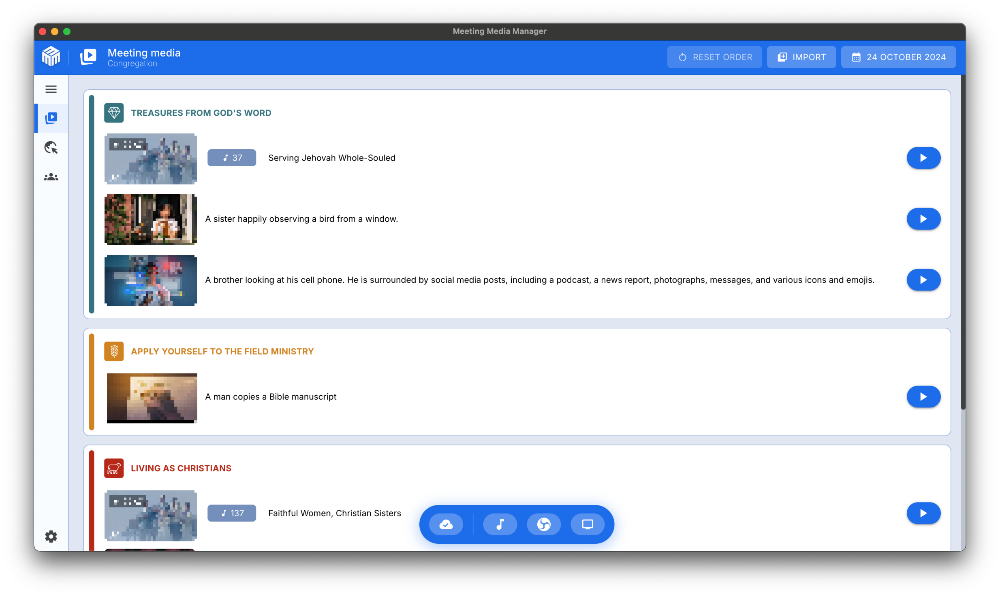

<!-- markdownlint-disable no-inline-html -->

# About Meeting Media Manager (M³)


## What is this app?

**Meeting Media Manager**, or **M³** for short, is an app for Windows, macOS and Linux, that automatically downloads pictures and videos that will be considered during congregation meetings of Jehovah's Witnesses, in any language found on the official website of Jehovah's Witnesses.

It features support for managing regular and custom meeting media, and support for multiple congregations and/or groups using the same computer account.

> [!NOTE]  
> M³ used to be known as JWMMF (JW Meeting Media Fetcher), but was renamed in May 2022.

## Why choose M³?

M³ is the ultimate tool for managing meeting media, offering a seamless, reliable, and feature-rich experience across platforms.

### Key benefits

- **Effortless media presentation**: Presenting media at its finest — just open M³ and everything works. No complex setup or extra steps required.

- **Multi-congregation support**: Manage settings for multiple congregations or groups easily within a single application.

- **Advanced features**: Easily add extra media, and automatically share what goes on at the Kingdom Hall with participants on Zoom.

- **Optimized cross-platform performance**: Enjoy a smooth and responsive experience on Windows, macOS, and Linux, even on older systems or computers with limited resources.

- **Reliable and stable**: Built to perform when you need it most. Encounter a bug? Report it, and it will be addressed promptly.

## What can M³ do?

In short, M³ allows you to easily and automatically download, synchronize, share and present all meeting media.

For **hybrid** or **in-person** congregation meetings, the integrated media presentation mode has all the features needed to simplify the task of sharing media with the congregation, including:

- Media thumbnails with the ability to zoom and pan, as well as set custom start and end times for media
- Easy-to-use pause/play/stop buttons to manage playback of media files
- Easy background music playback, with automatic stop before the start of regularly scheduled meetings
- Automatic external monitor recognition and management
- OBS Studio integration with automatic scene switching during media presentation
- Presenting the official website of Jehovah's Witnesses website on an external monitor
- Import JWPUB files, JWLPLAYLIST files, videos from the official website of Jehovah's Witnesses, and media for public talks from the S-34 file in a few clicks.
- Custom videos, pictures, audio files and even PDF files can be easily imported too!

**Give M³ a try today and see for yourself what it can do! Presenting media at congregation meetings has never been easier.**



## Does M³ work in my language?

**Yes!** Media for meetings of Jehovah's Witnesses can be automatically downloaded in any of the hundreds of language that are available on the official website of Jehovah's Witnesses. The list of available languages is dynamically updated; all you need to do is select which one you need.

In addition, M³ itself has been translated into several languages by many volunteers; you can therefore configure the language you would like to be displayed in M³'s interface.

### Translation Progress

<!-- markdownlint-capture -->
<!-- markdownlint-disable -->
<!-- prettier-ignore-start -->
<!-- CROWDIN-TRANSLATIONS-PROGRESS-ACTION-START -->


#### Available

<table><tr><td align="center" valign="top"></div><div align="center" valign="top">100%</td><td align="center" valign="top"></div><div align="center" valign="top">100%</td><td align="center" valign="top"></div><div align="center" valign="top">100%</td><td align="center" valign="top"></div><div align="center" valign="top">100%</td><td align="center" valign="top"></div><div align="center" valign="top">100%</td></tr><tr><td align="center" valign="top"></div><div align="center" valign="top">100%</td><td align="center" valign="top"></div><div align="center" valign="top">100%</td><td align="center" valign="top"></div><div align="center" valign="top">100%</td><td align="center" valign="top"></div><div align="center" valign="top">100%</td><td align="center" valign="top"></div><div align="center" valign="top">99%</td></tr><tr><td align="center" valign="top"></div><div align="center" valign="top">99%</td><td align="center" valign="top"></div><div align="center" valign="top">98%</td><td align="center" valign="top"></div><div align="center" valign="top">98%</td><td align="center" valign="top"></div><div align="center" valign="top">98%</td><td align="center" valign="top"></div><div align="center" valign="top">94%</td></tr></table>

#### In progress

<table><tr><td align="center" valign="top"></div><div align="center" valign="top">6%</td><td align="center" valign="top"></div><div align="center" valign="top">1%</td><td align="center" valign="top"></div><div align="center" valign="top">1%</td><td align="center" valign="top"></div><div align="center" valign="top">1%</td><td align="center" valign="top"></div><div align="center" valign="top">1%</td></tr><tr><td align="center" valign="top"></div><div align="center" valign="top">0%</td></table>
<!-- CROWDIN-TRANSLATIONS-PROGRESS-ACTION-END -->
<!-- prettier-ignore-end -->
<!-- markdownlint-restore -->

## Where can I find help about downloading and using M³?

Check out our [SUPPORT.md](https://github.com/sircharlo/meeting-media-manager/blob/master/SUPPORT.md) file for guidance or go directly to our [documentation website](https://sircharlo.github.io/meeting-media-manager/).

## Additional steps for macOS users to open the app without errors

If M³ won't open and displays an error like _“The app is damaged and can't be opened”_ or _“The app is damaged and can't be opened. You should move it to the Trash”_, follow these steps in Terminal (adjust the path as needed):

```bash
codesign --force --deep --sign - "/Applications/Meeting Media Manager.app"
sudo xattr -r -d com.apple.quarantine "/Applications/Meeting Media Manager.app"
```

If issues persist, please refer to our [documentation website](https://sircharlo.github.io/meeting-media-manager/using-at-a-kingdom-hall#additional-steps-for-macos-users) for more details.

## Does this app go against the Terms of Use of the official website of Jehovah's Witnesses?

**No.** Our use complies with the [Terms of Use](https://www.jw.org/finder?docid=1011511&prefer=content) of the official website of Jehovah's Witnesses. For more details, please refer to our [documentation website](https://sircharlo.github.io/meeting-media-manager/faq#terms-of-use).

## Want to help improve M³?

We'd love that! Please read [how to help us](https://github.com/sircharlo/meeting-media-manager/discussions/2771) in the corresponding discussion.
