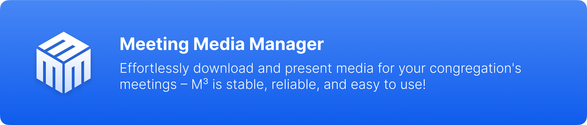

# Über Meeting Media Manager (M³) {#about-meeting-media-manager-m3}

## Was ist diese Anwendung? {#what-is-this-app}

**Meeting Media Manager**, oder **M³** für kurz, ist eine Anwendung für Windows, macOS und Linux, die automatisch Bilder und Videos herunterlädt, die während der Versammlungen der Zeugen Jehovas in jeder auf der offiziellen Website der Zeugen Jehovas verfügbaren Sprache berücksichtigt werden.

Sie unterstützt die Verwaltung von regulären und benutzerdefinierten Versammlungsmedien und bietet Unterstützung für mehrere Versammlungen und/oder Gruppen, die dasselbe Computer-Konto verwenden.

:::info Hinweis

M³ war früher als JWMMF (JW Meeting Media Fetcher) bekannt, wurde jedoch im Mai 2022 umbenannt.

:::

## Warum M³ wählen? {#why-choose-m3}

M³ ist das ultimative Werkzeug zur Verwaltung von Versammlungsmedien und bietet eine nahtlose, zuverlässige und funktionsreiche Erfahrung auf allen Plattformen.

### Wichtige Vorteile {#key-benefits}

- **Mühelose Medienpräsentation**: Präsentieren Sie Medien auf die beste Art — öffnen Sie einfach M³ und alles funktioniert. Keine komplexe Einrichtung oder zusätzliche Schritte erforderlich.

- **Unterstützung für mehrere Versammlungen**: Verwalten Sie Einstellungen für mehrere Versammlungen oder Gruppen problemlos in einer einzigen Anwendung.

- **Erweiterte Funktionen**: Fügen Sie ganz einfach zusätzliche Medien hinzu und teilen Sie automatisch, was in der Versammlung mit Zoom-Teilnehmern passiert.

- **Optimierte plattformübergreifende Leistung**: Genießen Sie eine reibungslose und reaktionsschnelle Erfahrung auf Windows, macOS und Linux, auch auf älteren Systemen oder Computern mit begrenzten Ressourcen.

- **Zuverlässig und stabil**: Entwickelt, um zu performen, wenn Sie es am meisten brauchen. Auf einen Fehler stoßen? Melden Sie sie, und sie werden schnell behoben.

## Was kann M³? {#what-can-m3-do}

Kurz gesagt, M³ ermöglicht es Ihnen, alle Versammlungsmedien einfach und automatisch herunterzuladen, zu synchronisieren, zu teilen und zu präsentieren.

Für **hybride** oder **präsente** Versammlungen bietet der integrierte Medienpräsentationsmodus alle Funktionen, die benötigt werden, um die Aufgabe des Medienteilens mit der Versammlung zu vereinfachen, einschließlich:

- Medien-Thumbnails mit der Möglichkeit, zu zoomen und zu schwenken sowie benutzerdefinierte Start- und Endzeiten für Medien festzulegen
- Einfache Pausen-, Abspiel- und Stopp-Tasten zur Verwaltung der Medienwiedergabe
- Einfaches Abspielen von Hintergrundmusik, mit automatischem Stoppen vor Beginn der regulären Versammlungen
- Automatische Erkennung und Verwaltung externer Monitore
- Integration von OBS Studio mit automatischem Szenenwechsel während der Medienpräsentation
- Präsentation der offiziellen Website der Zeugen Jehovas auf einem externen Monitor
- Import JWPUB files, JWLPLAYLIST files and videos from the official website of Jehovah's Witnesses in a few clicks.
- Import Study Bible media and audio recordings of the New World Translation of the Bible in seconds.
- Always have a public talks media overview (S-34) one click away and ready to be used any minute you need it.
- Benutzerdefinierte Videos, Bilder, Audiodateien und sogar PDF-Dateien können ebenfalls einfach importiert werden!

**Testen Sie M³ noch heute und überzeugen Sie sich selbst, was es leisten kann! Die Präsentation von Medien während der Versammlungen war noch nie so einfach.**

## Funktioniert M³ in meiner Sprache? {#does-m3-work-in-my-language}

**Ja!** Medien für Versammlungen der Zeugen Jehovas können in jeder der hunderten von Sprachen, die auf der offiziellen Website der Zeugen Jehovas verfügbar sind, automatisch heruntergeladen werden. Die Liste der verfügbaren Sprachen wird dynamisch aktualisiert; Sie müssen lediglich diejenige auswählen, die Sie benötigen.

Außerdem wurde M³ selbst in mehreren Sprachen von vielen Freiwilligen übersetzt, sodass Sie die Sprache konfigurieren können, die in der M³-Oberfläche angezeigt werden soll.
