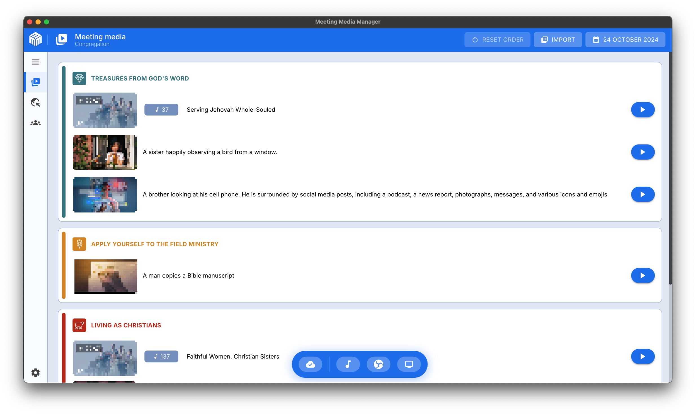

# Acerca de Meeting Media Manager (M³) {#about-meeting-media-manager-m3}

## ¿Qué es esta aplicación? {#what-is-this-app}

Meeting Media Manager, o M³ para abreviar, es una aplicación para Windows, macOS y Linux que descarga automáticamente imágenes y vídeos que se usarán durante las reuniones de congregación de los testigos de Jehová, en cualquier idioma que se encuentre en JW.org.

Incluye soporte para administrar multimedia de reuniones regulares y personalizados, y soporte para múltiples congregaciones y/o grupos que utilizan la misma cuenta de computadora.

:::info Nota

M³ solía ser conocido como JWMMF (JW Meeting Media Fetcher), pero fue renombrado en mayo de 2022.

:::

## ¿Por qué elegir M³? {#why-choose-m3}

M³ es la herramienta definitiva para la gestión de multimedia de reuniones, ofreciendo una experiencia sin fisuras, confiable y rica en características entre plataformas.

### Beneficios clave {#key-benefits}

- **Presentación multimedia sin esfuerzo**: Presentando multimedia en su máximo esplendor — sólo abre la M³ y todo funciona. No se requiere una configuración compleja ni pasos adicionales.

- **Soporte de múltiple congregación**: Gestiona la configuración para múltiples congregaciones o grupos fácilmente dentro de una sola aplicación.

- **Características avanzadas**: Agregue fácilmente multimedia extra, y comparta automáticamente lo que sucede en el Salón del Reino con los participantes en Zoom.

- **Rendimiento optimizado en múltiples plataformas**: Disfrute de una experiencia fluida en Windows, macOS y Linux, incluso en sistemas antiguos o computadoras con recursos limitados.

- **Seguro y estable**: Diseñado para trabajar cuando más lo necesites. ¿Encontró un error? Repórtelo, y se solucionará pronto.

## ¿Qué puede hacer M³? {#what-can-m3-do}

En resumen, M3 le permite descargar, sincronizar, compartir y presentar de forma fácil y automática todos los archivos multimedia de la reunión.

Para reuniones de congregación **híbridas** o **en persona**, el modo de presentación de contenidos integrado tiene todas las funciones necesarias para simplificar la tarea de compartir contenidos con la congregación, que incluyen:

- Miniaturas multimedia con la capacidad de acercar y acercar, así como establecer tiempos de inicio y fin personalizados para los medios
- Botones de pausa/reproducción/detener fáciles de usar para gestionar la reproducción de contenidos multimedia
- Fácil reproducción de música de fondo, con pausa automática antes del inicio de las reuniones periódicas
- Gestión y reconocimiento automático de monitores externos
- Integración de OBS Studio con cambio automático de escena durante la presentación de multimedia
- Presentación del sitio web oficial de Testigos de Jehová en un monitor externo
- Import JWPUB files, JWLPLAYLIST files and videos from the official website of Jehovah's Witnesses in a few clicks.
- Import Study Bible media and audio recordings of the New World Translation of the Bible in seconds.
- Always have a public talks media overview (S-34) one click away and ready to be used any minute you need it.
- ¡Vídeos personalizados, fotos, archivos de audio e incluso archivos PDF pueden ser fácilmente importados!

**¡Pruébalo hoy mismo y comprueba lo que puede hacer! Presentar multimedia en reuniones de congregación nunca ha sido más fácil.**

## ¿M³ funciona en mi idioma? {#does-m3-work-in-my-language}

¡Sí! Los medios para las reuniones de los Testigos de Jehová se pueden descargar automáticamente en cualquiera de los cientos de idiomas disponibles en JW.org. La lista de idiomas disponibles se actualiza dinámicamente; todo lo que necesita hacer es seleccionar cuál desea.

Además, M³ ha sido traducido a cada vez más idiomas, por muchos voluntarios; por lo tanto, puede configurar el idioma que le gustaría que se muestre en la interfaz de M³.
