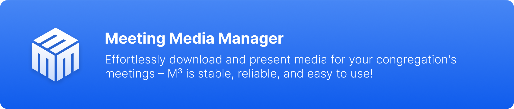
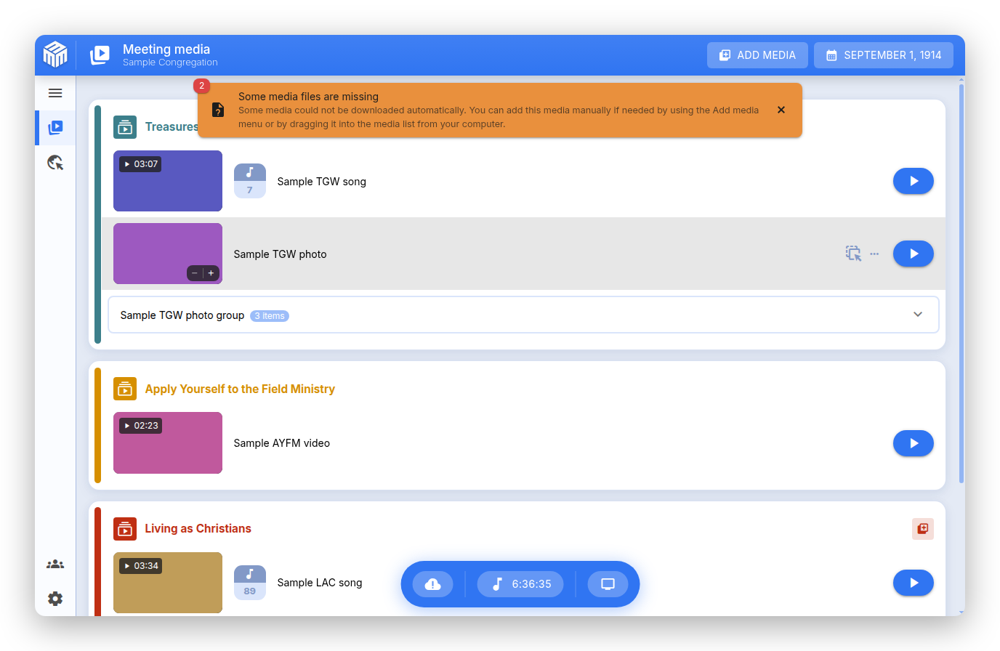

# Meeting Media Manager (M³) 소개 {#about-meeting-media-manager-m3}

## 소개 {#what-is-this-app}

**Meeting Media Manager**, 줄여서 **M³**는 여호와의 증인의 회중 집회에서 사용하는 사진과 동영상을 자동으로 다운로드하고 정리하고 표시해 주는 종합적인 프로그램입니다. Windows, macOS, Linux에서 사용할 수 있습니다. 여호와의 증인 공식 웹사이트에서 제공하는 모든 언어를 지원합니다.

M³를 사용하면 정규 집회에서 사용하는 미디어뿐 아니라 사용자가 추가한 미디어도 관리할 수 있습니다. 하나의 컴퓨터 계정에서 여러 회중이나 그룹의 설정을 관리할 수 있으며, 다양한 고급 표시 기능을 통해 미디어를 손쉽게 공유할 수 있습니다.

:::info 참고

이 프로그램은 이전에 JWMMF(JW Meeting Media Fetcher)라는 이름으로 알려져 있었지만, 2022년 5월에 Meeting Media Manager로 이름이 변경되었습니다.

:::

## M³로 무엇을 할 수 있나요? {#why-choose-m3}

M³는 집회 미디어를 관리하는 데 필요한 다양한 기능을 제공하는 편리하고 안정적인 프로그램입니다. 여러 운영 체제에서 원활하게 작동하며, 회중 집회의 필요에 맞게 특별히 설계되어 미디어를 효과적으로 표시하는 데 필요한 기능을 제공합니다.

### 주요 기능 {#key-benefits}

- **간편한 미디어 표시**: 미디어를 표시하는 과정이 매우 간편해집니다. M³를 실행하기만 하면 바로 사용할 수 있습니다. 복잡한 설정이나 추가 작업이 필요하지 않습니다.

- **여러 회중 지원**: 하나의 프로그램에서 여러 회중이나 그룹의 설정을 손쉽게 관리할 수 있습니다.

- **다양한 고급 기능**: 추가 미디어를 손쉽게 등록하고 사용자 지정 콘텐츠를 가져올 수 있습니다. 또한 왕국회관에서 진행되는 내용을 Zoom 참석자들에게 자동으로 공유할 수 있습니다.

- **최적화된 운영 체제별 성능**: Windows, macOS, Linux에서 원활하고 빠르게 작동합니다. 오래된 컴퓨터나 사양이 낮은 컴퓨터에서도 쾌적하게 사용할 수 있습니다.

- **높은 안정성과 신뢰성**: 필요한 순간에 안정적으로 작동하도록 설계되었습니다. 버그를 발견하셨나요? 문제를 신고해 주시면 신속하게 해결하겠습니다.

- **고급 미디어 표시 도구**: 다양한 미디어 제어 기능, 확대 및 이동 기능, 사용자 지정 재생 시간 설정, Zoom 및 OBS Studio와의 원활한 연동 기능을 제공합니다.

## M³를 한국어로도 사용할 수 있나요? {#what-can-m3-do}

M³는 집회에 필요한 모든 미디어를 손쉽게 자동으로 다운로드하고, 동기화하고, 공유하고, 표시할 수 있는 종합적인 미디어 관리 프로그램입니다. M³가 제공하는 주요 기능은 다음과 같습니다.

### 기본 미디어 관리 {#core-media-management}

- **자동 미디어 다운로드**: 다가오는 집회에 필요한 모든 미디어를 자동으로 검색하고 다운로드합니다.
- **다국어 지원**: 수백 가지 언어로 제공되는 미디어를 다운로드할 수 있습니다.
- **스마트 캐시 관리**: 지능적인 캐시 관리 기능을 통해 미디어를 체계적으로 정리하고 최신 상태로 유지합니다.
- **미디어 자동 정리**: 미디어를 집회 날짜와 프로그램 순서에 따라 자동으로 정리합니다.

### 미디어 표시 기능 {#about-presentation-features}

**대면 집회와 화상 회의를 병행하는 집회** 또는 **대면 집회**에서 사용할 수 있는 통합 미디어 표시 모드는 다음과 같은 기능을 제공합니다.

- **고급 미디어 제어**: 미디어의 미리 보기 이미지와 확대 및 이동 기능을 제공합니다.
- **사용자 지정 재생 시간**: 미디어의 재생 시작 시간과 종료 시간을 원하는 대로 설정할 수 있습니다.
- **재생 제어**: 사용하기 쉬운 일시 정지, 재생, 정지 버튼과 키보드 단축키를 제공합니다.
- **실시간 미리 보기 및 재생 속도 조절**: 청중에게 표시되는 화면을 미리 확인하고, 필요에 따라 오디오나 동영상의 재생 속도를 조절할 수 있습니다.
- **다중 모니터 지원**: 외부 모니터를 자동으로 감지하고 관리합니다.
- **깔끔한 미디어 표시**: 불필요한 요소 없이 미디어에만 집중할 수 있는 화면을 제공합니다.

### 배경 음악 {#about-background-music}

- **지능적인 재생 기능**: 집회 시작 전에 배경 음악이 자동으로 중지됩니다.
- **클릭 한 번으로 다시 재생**: 집회가 끝난 후 클릭 한 번으로 배경 음악을 다시 재생할 수 있습니다.
- **음량 조절**: 배경 음악의 음량을 조절할 수 있으며, 음악이 서서히 작아지면서 끝나도록 설정할 수도 있습니다.

### Zoom 연동 {#about-zoom-integration}

- **자동 화면 공유**: 미디어 재생을 시작하거나 중지할 때 Zoom 화면 공유도 자동으로 시작하거나 중지할 수 있습니다.

### OBS Studio 연동 {#about-obs-integration}

- **자동 장면 전환**: 대면 집회와 화상 회의를 병행할 때 OBS Studio와 원활하게 연동됩니다.
- **장면 관리**: 카메라 화면, 미디어 화면 및 기타 장면 사이를 자동으로 전환할 수 있습니다.
- **녹화 제어**: 해당 기능을 활성화하면 M³에서 OBS 녹화를 시작하거나 중지할 수 있습니다.

### 미디어 가져오기 및 관리 {#about-media-import}

- **JWPUB 파일**: JWPUB 파일을 손쉽게 가져오고 관리할 수 있습니다.
- **JWLPLAYLIST 파일**: JW Library의 재생 목록 파일을 지원합니다.
- **사용자 지정 미디어**: 동영상, 사진, 오디오 파일, PDF 파일을 직접 가져올 수 있습니다.
- **성경 관련 미디어**: 연구용 성경의 미디어, 수어 성경의 미디어, 「신세계역 성경」의 오디오 녹음 파일을 가져올 수 있습니다.
- **공개 강연**: S-34 파일 가져오기 기능을 사용하면 공개 강연에 필요한 미디어 목록을 언제든지 확인하고 사용할 수 있습니다.

### 고급 기능 {#about-advanced-features}

- **폴더 감시**: 지정한 폴더(Dropbox, OneDrive 등)의 미디어를 자동으로 동기화합니다.
- **미디어 내보내기**: 미디어를 날짜별로 정리하여 지정한 폴더로 자동으로 내보낼 수 있습니다.
- **웹사이트 표시**: 여호와의 증인 공식 웹사이트를 외부 모니터에 표시할 수 있습니다.
- **집회 타이머**: 선택적으로 타이머 창을 표시하여 집회 프로그램의 진행 시간을 측정할 수 있습니다.
- **집회 녹화 지원**: OBS Studio나 외부 녹화 프로그램의 녹화 기능을 제어할 수 있습니다.
- **키보드 단축키**: 다양한 기능의 키보드 단축키를 원하는 대로 설정할 수 있습니다.
- **여러 프로필 관리**: 회중이나 그룹별로 별도의 프로필을 만들어 관리할 수 있으며, 프로필 설정을 가져오거나 내보낼 수도 있습니다.

## 내가 사용하는 언어로도 M³가 작동하나요? {#does-m3-work-in-my-language}

**물론입니다!** M³는 다양한 언어를 폭넓게 지원합니다.

여호와의 증인 공식 웹사이트에서 제공하는 수백 가지 언어 중 원하는 언어로 집회 미디어를 자동으로 다운로드할 수 있습니다. 지원되는 언어 목록은 자동으로 업데이트되므로, 처음 설정할 때 원하는 언어를 선택하기만 하면 됩니다.

### 인터페이스 언어 {#interface-languages}

M³는 자원봉사자들의 도움으로 여러 언어로 번역되었습니다. 미디어를 다운로드할 때 사용하는 언어와 관계없이 M³의 인터페이스 언어를 별도로 설정할 수 있습니다. 따라서 M³는 자신에게 익숙한 언어로 사용하면서 집회 미디어는 다른 언어로 다운로드할 수 있습니다.

대체 언어와 자막에 관한 자세한 내용은 [자주 묻는 질문](faq#language-support)을 참조하세요.

## 시스템 요구 사항 {#system-requirements}

지원되는 운영 체제와 시스템 요구 사항에 관한 자세한 내용은 [자주 묻는 질문](faq#technical-questions)을 참조하세요.

**지금 M³를 사용해 보고 다양한 기능을 직접 확인해 보세요! 집회에서 미디어를 표시하는 일이 훨씬 간편해집니다.**

