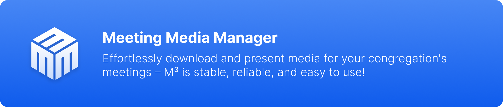
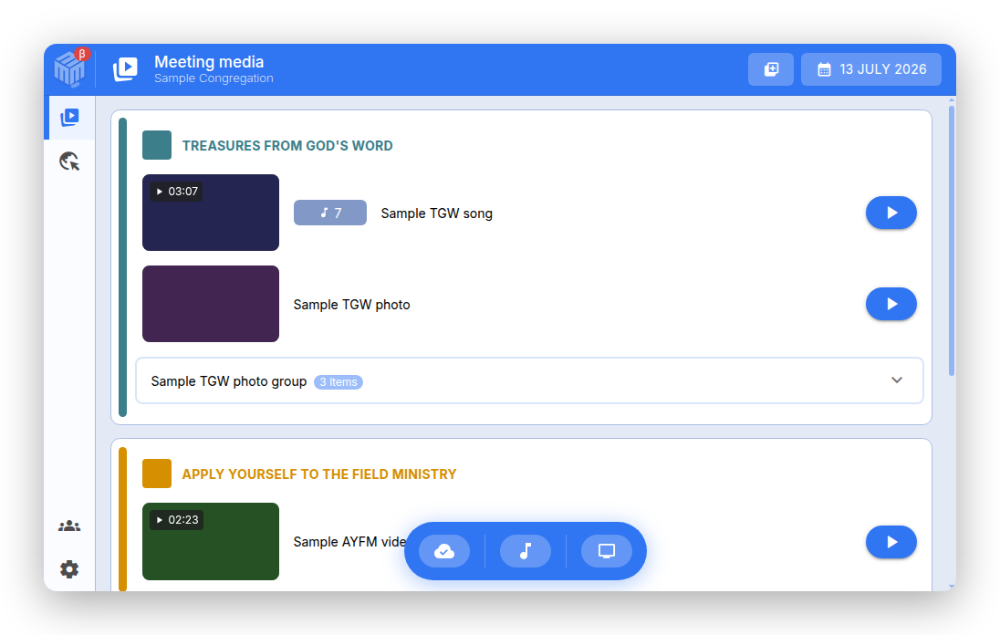

# О Meeting Media Manager (M³) {#about-meeting-media-manager-m3}

## Что это за приложение? {#what-is-this-app}

**Meeting Media Manager**, или сокращенно **M³**, — это всеобъемлющее кроссплатформенное приложение для Windows, macOS и Linux, которое автоматически загружает, упорядочивает и демонстрирует изображения и видео для встреч собрания Свидетелей Иеговы. Оно поддерживает любой язык, доступный на официальном веб-сайте Свидетелей Иеговы, и предоставляет мощные инструменты для управления мультимедиа как во время гибридных, так и очных встреч.

M³ может помочь в управлении мультимедиа для обычных встреч, а также для специальных мероприятий. Оно может обрабатывать различные конфигурации для различных собраний и/или групп, которые используют одну и ту же учетную запись на компьютере, и имеет расширенные возможности для демонстрации мультимедиа.

:::info Примечание

Это приложение раньше называлось JWMMF (JW Meeting Media Fetcher), но в мае 2022 года было переименовано в Meeting Media Manager.

:::

## Почему стоит выбрать M³? {#why-choose-m3}

M³ - это идеальный инструмент для представления мультимедиа во время встреч, обеспечивающий бесперебойную, надежную и многофункциональную производительность на всех платформах. Оно разработано специально для нужд встреч собраний и предоставляет все необходимые функции для эффективной демонстрации мультимедиа.

### Ключевые преимущества {#key-benefits}

- **Удобное представление мультимедиа**: Презентация мультимедиа на высшем уровне - просто откройте M³, и все получится. Не требуется никаких сложных настроек или дополнительных действий.

- **Поддержка многих собраний**: Легко управляйте настройками нескольких собраний или групп в одном приложении.

- **Расширенные функции**: Легко добавляйте дополнительные мультимедийные файлы, импортируйте пользовательские данные и автоматически обменивайтесь с участниками Zoom тем, что отображается в Зале Царства.

- **Оптимизированная кроссплатформенная производительность**: Наслаждайтесь плавной и отзывчивой работой в Windows, macOS и Linux, даже на старых системах или компьютерах с ограниченными ресурсами.

- **Надежно и стабильно**: Создано специально для того, чтобы выполнять свои функции, когда они вам больше всего нужны. Столкнулись с ошибкой? Сообщите об этом, и проблема будет оперативно решена.

- **Расширенные инструменты для демонстрации**: Расширенные средства управления мультимедиа, возможности масштабирования и панорамирования, пользовательская настройка времени и бесшовная интеграция с Zoom и OBS Studio.

## Каковы функции M³? {#what-can-m3-do}

M³ is a comprehensive media management solution that allows you to easily and automatically download, synchronize, share, and present all meeting media. Here's what makes M³ powerful:

### Core Media Management {#core-media-management}

- **Automatic media downloads**: Automatically fetches and downloads all media needed for upcoming meetings
- **Multi-language support**: Download media in any of hundreds of available languages
- **Smart caching**: Intelligent caching system that keeps media organized and up-to-date
- **Media organization**: Automatically organizes media by date and meeting section

### Media Presentation Features {#about-presentation-features}

For **hybrid** or **in-person** congregation meetings, the integrated media presentation mode includes:

- **Advanced media controls**: Media thumbnails with zoom and pan capabilities
- **Custom timing**: Set custom start and end times for media playback
- **Playback controls**: Easy-to-use pause/play/stop buttons with keyboard shortcuts
- **Live preview and speed control**: Preview the audience display and optionally adjust audio or video playback speed
- **Multi-monitor support**: Automatic external monitor detection and management
- **Clean presentation**: Distraction-free media presentation interface

### Background Music {#about-background-music}

- **Intelligent playback**: Background music that automatically stops before meetings start
- **One-click restart**: Resume background music with a single click after meetings
- **Volume control**: Adjustable background music volume with fade-out capabilities

### Zoom Integration {#about-zoom-integration}

- **Automatic screen sharing**: Start and stop Zoom screen sharing automatically when you play or stop media

### OBS Studio Integration {#about-obs-integration}

- **Automatic scene switching**: Seamless integration with OBS Studio for hybrid meetings
- **Scene management**: Automatic switching between camera, media, and other scenes
- **Recording controls**: Start and stop OBS recordings from M³ when enabled

### Media Import and Management {#about-media-import}

- **JWPUB files**: Import and manage JWPUB files with ease
- **JWLPLAYLIST files**: Support for JW Library playlist files
- **Custom media**: Import custom videos, pictures, audio files, and PDF files
- **Bible media**: Import Study Bible media, sign-language Bible media, and audio recordings of the New World Translation
- **Public talks**: Always have public talk media overview ready to use with the S-34 importer

### Advanced Features {#about-advanced-features}

- **Folder monitoring**: Automatically sync media from watched folders (Dropbox, OneDrive, etc.)
- **Media export**: Automatically export media to folders, organized by date
- **Website presentation**: Present the official website on external monitors
- **Meeting timer**: Optional timer window for timing meeting parts
- **Meeting recording helpers**: Control OBS recording or an external recording application
- **Keyboard shortcuts**: Customizable keyboard shortcuts for many functions
- **Multiple profiles**: Manage different congregations or groups with separate profiles, including profile settings import and export

## Работает ли M³ на моём языке? {#does-m3-work-in-my-language}

**Yes!** M³ provides comprehensive multi-language support:

Media for meetings of Jehovah's Witnesses can be automatically downloaded in any of the hundreds of languages available on the official website of Jehovah's Witnesses. The list of available languages is dynamically updated; all you need to do is select which one you need during setup.

### Interface Languages {#interface-languages}

M³ itself has been translated into many languages by volunteers. You can configure the language you would like to be displayed in M³'s interface, independent of the language used for media downloads. This means you can use M³ in your preferred language while downloading media in any other supported language.

For details about fallback languages and subtitles, see the [FAQ](faq#language-support).

## System Requirements {#system-requirements}

For supported operating systems and requirements, see the answers in the [FAQ](faq#technical-questions).

**Попробуйте M³ сегодня и убедитесь сами, на что оно способно! Представление мультимедиа во время встреч легче чем когда-либо.**

