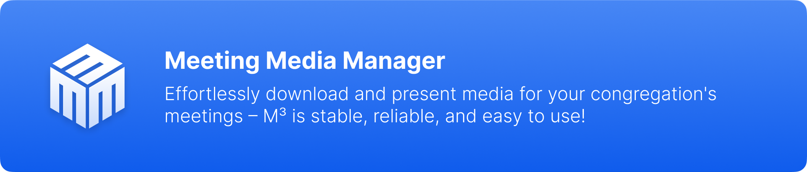
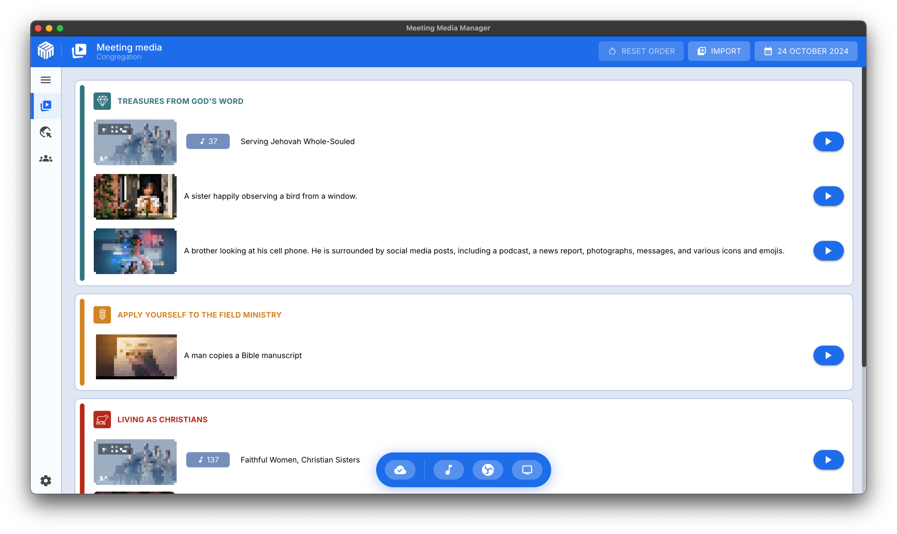

# Nō ni’a iā Meeting Media Manager (M³) {#about-meeting-media-manager-m3}

## E aha teie fa’anahora’a? {#what-is-this-app}

Te Meeting Media Manager, a rā i pi’ihia M³ nō te ha’apoto, hō’ē ia fa’anahora’a rorouira ’ā’ano nō te Windows, macOS ’e Linux, ’o te tātari noa i te tōtarara’a, te fa’anahora’a, ’e te fa’a’itera’a i te mau hōho’a ’e te mau tōtafifi nō te mau rurura’a a te amuira’a a te Ite o Iehova. E tōturihia te mau reo ato’a e vai ra i ni’a i te tahua natirara mana a te Ite o Iehova, ’e e hōro’a mai te reira i te mau rāve’a pūai nō te fa’anaho i te mau media nō te mau rurura’a vārua (mixte) ’e te mau rurura’a ta’ata-roa-hia.

Te vai ra i roto iā M³ te tōturu nō te fa’atere i te mau media mātauhia ’e te mau media ta’a ’ē nō te rurura’a, te rave-ato’a-ra’a i te tahi mau amuira’a ’e/’aore rā te mau pupu i ni’a i te hō’ē ā tōfati rorouira, ’e te mau rāve’a fa’a’itera’a hōhonu ’o te fa’ariro i te ’ōpere-media ’ei mea ’ōhie roa.

:::info Nota

I mātua pi’ihia na teie fa’anahora’a iā JWMMF (JW Meeting Media Fetcher), nō te tauihia rā tōna i’oa ’ei Meeting Media Manager i te ’āva’e mē nō te matahiti 2022.

:::

## Nō te aha e mā’iti ai iā M³? {#why-choose-m3}

’O M³ te rāve’a hira nō te fa’atere i te mau media nō te rurura’a, ’o te hōro’a mai i te hō’ē ’ohipara’a mania, pāpū, ’e te ’ā’ano i te mau huru rāve’a ato’a i ni’a i te mau tahua rorouira ato’a. ’Ua hāhamanihia te reira nō te mau hina’aro ta’a ’ē o te mau rurura’a a te amuira’a, ’e e hōro’a mai i te mau mea ato’a e tītauhia nō te hō’ē fa’a’itera’a media manuia.

### Mau fana’ora’a pu’e {#key-benefits}

- Fa’a’itera’a media ’ōhie roa: Te fa’a’itera’a media maita’i roa a’e — ’a hāha’i noa iā M³ ’e e tano te mau mea ato’a. ’Aore e fa’anahora’a ta’arepurepu ’aore rā e ta’ahira’a hau e tītauhia.

- Tōturu nō te tahi mau amuira’a: ’A fa’atere ’ōhie i te mau tātara’a nō e rave rahi amuira’a ’e/’aore rā te mau pupu i roto i te hō’ē noa fa’anahora’a.

- Mau fa’anahora’a hōhonu: ’A ’āmui ’ōhie i te tahi atu mau media, ’a fa’atōro’a i te mau parau ta’a ’ē, ’e ’a ’ōpere i’oa-noa i te mau mea e tupu ra i te Piha a te Basileia i te feia i ni’a iā Zoom.

- ’Ohipara’a mania i ni’a i te mau tahua ato’a: ’A fana’o i te hō’ē ’ohipara’a mania ’e te vitiviti i ni’a iā Windows, macOS, ’e Linux, i ni’a ato’a i te mau rorouira tahito ’aore rā te mau rorouira rāve’a iti.

- Pāpū ’e te tōtōā-’ore: ’Ua hāhamanihia nō te tere maita’i i te taime e hina’aro-roa-hia ai. ’Ua fārerei i te hō’ē paruparu pororamu? ’A fa’a’ite mai, ’e e roromi-vitiviti-hia te reira.

- Mau rāve’a fa’a’itera’a hōhonu: Mau fa’aterera’a media hōhonu, rāve’a fa’arahi/fa’ahu’e, fa’aa’ano i te taime, ’e te tū’atira’a mania o Zoom ’e o OBS Studio.

## E aha te mau rāve’a a M³? {#what-can-m3-do}

’O M³ te hō’ē rāve’a ’ā’ano nō te fa’atere i te media, ’o te tauturu iā ’oe nō te tō, nō te tū’ati, nō te ’ōpere, ’e nō te fa’a’ite ’ōhie ’e te i’oa-noa i te mau media ato’a nō te putuputura'a. Teie te mea e fa’apūai ra iā M³:

### Te rāve’a matamua nō te fa’atere i te media {#core-media-management}

- Tōra’a media i’oa-noa: E tīti’a ’e e tō i’oa-noa te reira i te mau media ato’a e hina’arohia nō te mau putuputura’a e haere mai ra
- Tōturu nō te tahi mau reo: ’A tō i te media i roto i te hō’ē o te mau rau reo e vai ra
- Ha’aputura’a pa’ari: Fa’anahora’a ha’aputura’a māramarama ’o te fa’anaho ’e ’o te fa’ahou i te media
- Fa’anahora’a media: E fa’anaho i’oa-noa te reira i te media i te mahana ’e te tuha’a o te putuputura’a

### Mau rāve’a fa’a’itera’a media {#about-presentation-features}

Nō te mau putuputura’a ’āmui ’aore rā i te vāhi rurura’a, te vai ra i roto i te rāve’a fa’a’itera’a media:

- Mau fa’aterera’a media hōhonu: Mau ho’ho’a media ri’i ’e te rāve’a fa’arahi ’e te fa’ahu’e
- Fa’aa’ano i te taime: ’A fa’anaho i te taime ha’amatara’a ’e te taime fa’ahope’ara’a ta’a ’ē nō te fa’ata’ira’a media
- Mau fa’aterera’a fa’ata’ira’a: Mau pitopito fa’ahoromāha/fa’ata’i/fa’ahope ’ōhie ma te mau rāve’a ’ōpau o te pitopitora’a parau
- Hi’opo’a-mua-ra’a ora e te fa’atere-re’a: A hi’opo’a-mua i te fa’a’ite-ra’a i te feiā mata’ita’i, e mai te peu e hina’aro ’oe, a fa’atere i te vitiviti o te fa’aro’o aore rā o te video
- Tōturu nō te tahi mau pāpau uira: ’Ite-i’oa-noa-ra’a ’e te fa’aterera’a o te pāpau uira nō rati
- Fa’a’itera’a ma’atua: Fa’anahora’a fa’a’itera’a media mā nō te pāruru i te fāfārea

### Pehe fāfārea {#about-background-music}

- Fa’ata’ira’a māramarama: E fa’ahope i’oa-noa te pehe fāfārea hou te ha’amatara’a o te mau putuputura’a
- Ha’amata-fa’ahou-ra’a ma te tōna’a hō’ē: ’A fa’ata’i fa’ahou i te pehe fāfārea ma te tōna’a hō’ē noa i muri i te mau putuputura’a
- Fa’anahora’a tōna: E nehenehe e fa’atano i te tōna o te pehe fāfārea ma te rāve’a fa’amāru-mārie-ra’a

### Tū’atira’a ’e o Zoom {#about-zoom-integration}

- Tuha’ara’a pāpau uira i’oa-noa: E ha’amata ’e e fa’ahope i’oa-noa te tuha’ara’a pāpau uira a Zoom i te taime e fa’ata’i ’aore rā e fa’ahope ai ’oe i te media

### Tū’atira’a ’e o OBS Studio {#about-obs-integration}

- Tauira’a vāhi i’oa-noa: Tū’atira’a hō’ē-noa ’e o OBS Studio nō te mau putuputura’a ’āmui
- Fa’aterera’a vāhi: Tauira’a i’oa-noa i rōpū i te tāmata, te media, ’e te tahi atu mau vāhi
- Te mau fa’atere-ra’a haruharu-reo: A ha’amata e a fa’aea i te mau haruharu-reo OBS mai roto mai i te M³ ia ha’amā-hia

### Te tōra’a mai ’e te fa’aterera’a media {#about-media-import}

- Mau putu’ite JWPUB: ’A tō mai ’e ’a fa’atere i te mau putu’ite JWPUB ma te ’ōhie
- Mau putu’ite JWLPLAYLIST: Tōturu nō te mau putu’ite rāpahu pehe a te JW Library
- Media i’oti: ’A tō mai i te mau tōta’ira’a pata, te mau hōho’a, te mau putu’ite fa’aro’o, ’e te mau putu’ite PDF i’oti
- Te mau ve’a Bibilia: A tāvaha i te mau ve’a Bibilia ha’api’ira’a, te mau ve’a Bibilia reo o te rima, e te mau haruharu-reo o te Huriraa o te ao apī
- Mau orara’a parau i te ta’ata: ’A vaiiho noa i te hi’o-fa’ahou-ra’a media o te mau orara’a parau i te ta’ata ia ineine nō te fa’ahana’a ’e te tō mai S-34

### Mau rāve’a hōhonu {#about-advanced-features}

- Arata’ira’a rāfao: E tū’ati i’oa-noa i te media nō roto mai i te mau rāfao e mātāitaihia (Dropbox, OneDrive, ’e te tahi atu)
- Hāpono-fa’aho’i-ra’a media: E hāpono-fa’aho’i i’oa-noa i te media i roto i te mau rāfao, fa’anahohia mā te tai’o mahana
- Te fa’a’itera’a pae natirara: Fa’a’ite i te pae natirara mana i ni’a i te mau piha hi’o nō rāpae
- Te taime o te putuputura’a: Tei mā’itihia te ha’amaramarama taime no te faito i te mau tuha’a o te putuputura’a
- Te mau tauturu nō te haruharu-reo i te putuputura’a: A fa’atere i te haruharu-reo OBS aore rā i te tahi atu fa’anahora’a haruharu-reo i rapae
- Mau rāve’a ’atuna’o: E nehenehe e fa’anaho i te mau rāve’a ’atuna’o nō te tahi atu mau ’ohipa
- Te mau hoho’a-taata rau: A fa’atere i te mau amuira’a aore rā te mau pǔpǔ taa ’ē ma te mau hoho’a-taata taa ’ē, ia amui ato’a te tāvaha-ra’a e te fa’ahapono-ra’a i te mau fa’anahora’a o te hoho’a-taata

## E tano ānei te M³ i roto i tō’u reo? {#does-m3-work-in-my-language}

’Ēiaha! E pū’oira’a parau nō te rave rau reo tō roto i te M³:

E nehenehe e tātari i’oa-noa i te mau media nō te mau putuputura’a a te mau Ite nō Iehova i roto i te mau rau reo e vai nei i ni’a i te pae natirara mana a te mau Ite nō Iehova. Te tāmāhanahia nei te tāpura o te mau reo e vai nei; e mā’iti noa ’oe i te reo e hina’arohia i te taime nō te fa’anahora’a.

### Te mau reo nō te tū’atira’a {#interface-languages}

​Ua huri-fa’ahou-hia te M³ iho i roto i te rave rau reo e te mau rima tauturu. E nehenehe tā ’oe e fa’anaho i te reo e fa’a’itehia i ni’a i te tū’atira’a a te M³, ta’a ’ē noa atu i te reo e fa’a’ohipahia nō te tātari-ra’a media. Te aura’a rā, e nehenehe tā ’oe e fa’a’ohipa i te M³ mā tō ’oe reo tātarihiahia, i te taime ho’i e tātarihia ai te mau media mā te tahi atu reo e pāturuhia nei.

Nō te tahi atu mau ha’amāramaramara’a nō hi’a i te mau reo mono ’ē e te mau parau fa’ata’a i raro, ’a hi’o i te [FAQ](faq#language-support).

## Te mau tītau’ara’a nō te fa’anahora’a {#system-requirements}

​Nō te mau fa’anahora’a fa’ahorora’a e te mau tītau’ara’a e pāturuhia nei, ’a hi’o i te mau pāhonora’a i roto i te [FAQ](faq#technical-questions).

’A tāmata na i te M³ i teie mahana nō te hōro’a mai i tō ’oe iho mana’o i ni’a i tāna e nehenehe e rave! ’Aita e mea ’ōhie a’e nō te fa’a’ite i te mau media i te mau putuputura’a a te amuira’a

